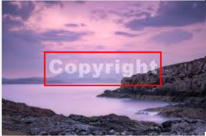
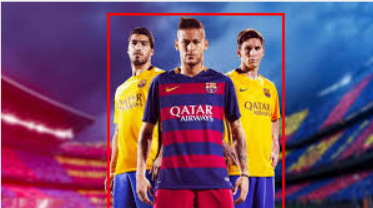

# 🖌️ LaMa Bounding Box Inpainter

An easy-to-use **Tkinter GUI** for inpainting selected regions of an image using **[simple-lama-inpainting](https://github.com/advimman/lama)**.  
You can draw bounding boxes on an image, and the app will remove/inpaint those areas using LaMa’s powerful deep learning model.

**you can remove watermarks or anything !!**

---

## 📜 Overview

**Features:**
- Load and display any `.jpg`, `.jpeg`, `.png`, `.bmp`, `.tiff`, `.gif` image.
- Select multiple regions with your mouse.
- Inpaint selected regions with LaMa model.
- Clear all selections at once.
- Save the final processed image.
- Works on **CPU mode** by default for compatibility.

---

## 🖼️ Demo

Below are example results from the app.  

| Original | Selections | Inpainted |
|----------|------------|-----------|
|  |  |  |
|  |  |  |


---

## 🛠️ Installation

### 1️⃣ Clone the repository
```bash
git clone https://github.com/yourusername/lama-bbox-inpainter.git
cd lama-bbox-inpainter
```

### 2️⃣ Create and activate a virtual environment
```bash
# Create venv
python -m venv venv

# Activate venv
# On Windows:
venv\Scripts\activate
pip install -r venv\requirements.txt

```

## 🚀 Usage

Run the app:
```bash
python lama.py
```

